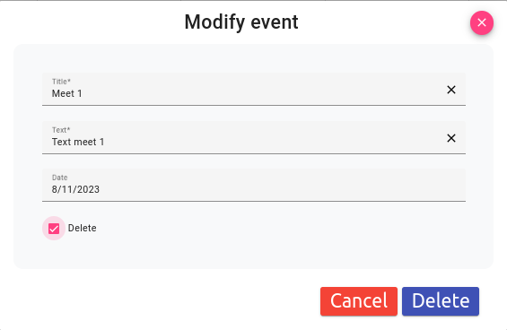
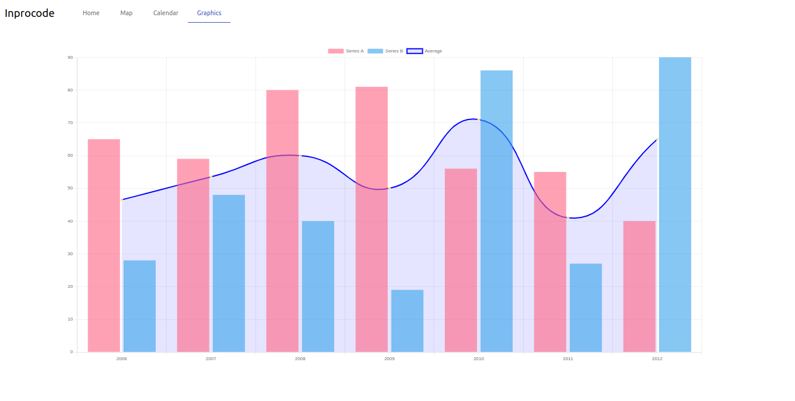

# IT Academy Sprint 8 Angular IV Inprocode.

### Environment setup

## Clone repository

git clone https://github.com/manuelgarciacr/ita-angular-s8-ng-4.git

## Install dependencies

Install dependencies with "npm i"

## Add the folder to the vscode workspace

## Technologies

* Framework: Angular  16
* Layout: Bootstrap 5 classes
* Controls: Angular Material
* Calendar: @fullcalendar/angular  6.1.9
* Maps: @mapbox/mapbox-gl-draw  1.4.3
* &nbsp;&nbsp;&nbsp;&nbsp;&nbsp;&nbsp;mapbox-gl  2.15.0
* &nbsp;&nbsp;&nbsp;&nbsp;&nbsp;&nbsp;ngx-mapbox-gl  10.0.0
* Graphics: ng2-charts 5.0.3
* Excel: write-excel-file 1.4.27
* Hash: bcryptjs 2.4.3

## Start the application in developing mode

npm start

An integrated server starts the application and automatically displays it in the browser.

## Home. Users CRUD

### Add user

A dialog window with a form is displayed. Errors appear in red. There are buttons to clear the fields and one to display the password. The ADD button is disabled until all data is error free.

If a user exists with the same email, a new one will not be created.

Passwords are hashed before being sent to the server. The data is paged onto the screen. By default 5 elements per page.

Data can be sorted by clicking on a column header (Here it appears sorted by email)

### Edit and delete user

We can also edit and delete users

### Export to Excel

The grid with users can be exported to Excel. The browser downloads it automatically.

## Map. Draw, save, recover and filter data on a map

Controls for resizing the map are displayed in the upper left corner of the map. If you hold down the compass, the map rotates around the center. The geolocation is updated by pressing the last button in the group.

The three buttons at the top right of the map allow you to paint relatively polylines, polygons, and points. Points and vertices can be moved around the map once painted. Double click to finish painting a figure. Use the delete key or the trash button to delete a point or shape. The image shows a polyline, a triangle and several points on the street.

The Save button allows you to save a new collection of shapes or overwrite an existing one. Names are always lowercase and may include spaces. Already saved points are displayed on the map as markers.

The Load button clears the map and loads a collection from the database.

## Layers filter Attractions and  restaurants.

You can add a collection of points called 'attractions' and another called 'restaurants' to the database. By checking or unchecking the options in the list to the right of the map, you can show or hide these collections. Newly created collections are not displayed until you restart the map page.

## Calendar

You can add an all day event by clicking on a cell. Clicking an event, you can modify or delete it.

## Graphics

The application shows a harcoded group of datas in a bars and line mixed chart.

